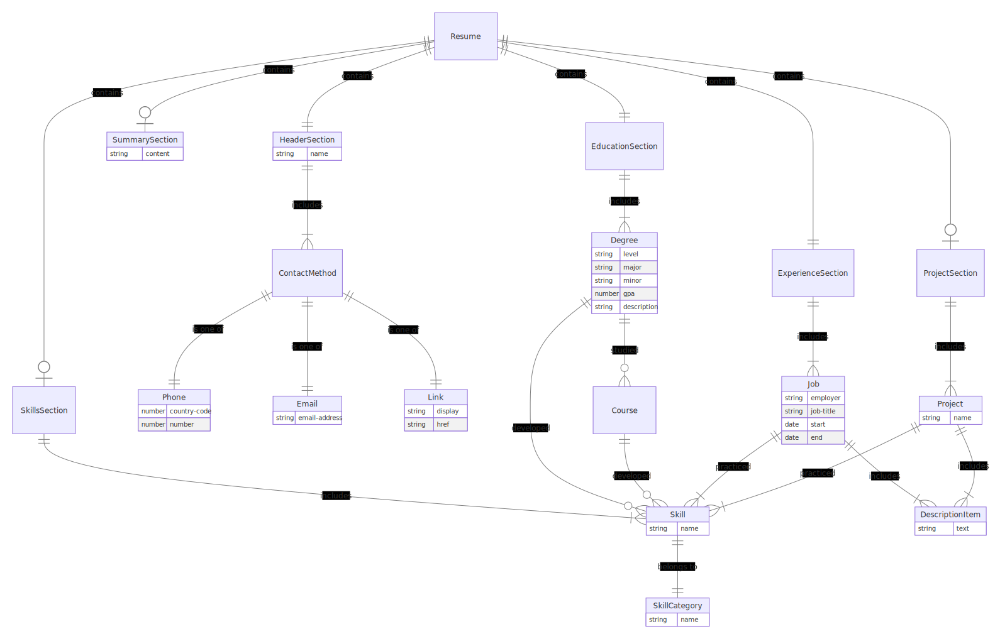

org:

```
src/
|  # everything here is in bin
|- main # inits stuff from clap args/env vars:
|       # - starts logger
|       # - builds app/router context obj incl:
|       #   - store w/ db conn
|       #   - initial location
|       # - starts app loop
|- app # app factory that uses given context and config to:
|      # - impls any extra error handling? 
|      # - creates new router
|      # - describes root routing table
|      # - builds root menu interaction
|  # everything else is organized by feature, 
|  # including sub routing tables and error boundaries?
|  # Feature group: data manipulation interactions
|- resume/
|  |- models
|  |- handlers
|  |- interactions # maybe called flows?
|- contact/
|  |- models
|  |- handlers
|  |- interactions
|- education/
|  |- models
|  |- handlers
|  |- interactions
|- job/
|  |- models
|  |- handlers
|  |- interactions
|- project/
|  |- models
|  |- handlers
|  |- interactions
|- about/ # maybe caused summary?
|  |- models
|  |- handlers
|  |- interactions
|  # Feature: output generation
|- generator/ # 
|  |- markdown
|  |- html
|  |- pdf
|  |- .doc?
|  # Everything else is generalized libraries 
|  # for implementing in bin
|- lib
|- router
|- store
|- state
|- change
|- model
```